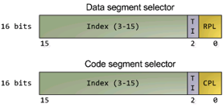

#### 保护模式和分段机制

为何要了解Intel 80386的保护模式和分段机制？首先，我们知道Intel 80386只有在进入保护模式后，才能充分发挥其强大的功能，提供更好的保护机制和更大的寻址空间，否则仅仅是一个快速的8086而已。没有一定的保护机制，任何一个应用软件都可以任意访问所有的计算机资源，这样也就无从谈起操作系统设计了。且Intel 80386的分段机制一直存在，无法屏蔽或避免。其次，在我们的bootloader设计中，涉及到了从实模式到保护模式的处理，我们的操作系统功能（比如分页机制）是建立在Intel 80386的保护模式上来设计的。如果我们不了解保护模式和分段机制，则我们面向Intel 80386体系结构的操作系统设计实际上是建立在一个空中楼阁之上。
 
【注意】虽然大家学习过X86汇编，对X86硬件架构有一定了解，但对X86保护模式和X86系统编程可能了解不够。为了能够清楚了解各个实验中汇编代码的含义，我们建议大家阅读如下参考资料：

- 可先回顾一下lab0-manual中的“了解处理器硬件”一节的内容。
- 《Intel 80386 Reference Programmers Manual-i386》：第四、六、九、十章。在后续实验中，还可以进一步阅读第五、七、八等章节。
 
(1) 实模式

在bootloader接手BIOS的工作后，当前的PC系统处于实模式（16位模式）运行状态，在这种状态下软件可访问的物理内存空间不能超过1MB，且无法发挥Intel 80386以上级别的32位CPU的4GB内存管理能力。

实模式将整个物理内存看成分段的区域，程序代码和数据位于不同区域，操作系统和用户程序并没有区别对待，而且每一个指针都是指向实际的物理地址。这样，用户程序的一个指针如果指向了操作系统区域或其他用户程序区域，并修改了内容，那么其后果就很可能是灾难性的。通过修改A20地址线可以完成从实模式到保护模式的转换。有关A20的进一步信息可参考附录“关于A20 Gate”。

(2) 保护模式

只有在保护模式下，80386的全部32根地址线有效，可寻址高达4G字节的线性地址空间和物理地址空间，可访问64TB（有2^14个段，每个段最大空间为2^32字节）的逻辑地址空间，可采用分段存储管理机制和分页存储管理机制。这不仅为存储共享和保护提供了硬件支持，而且为实现虚拟存储提供了硬件支持。通过提供4个特权级和完善的特权检查机制，既能实现资源共享又能保证代码数据的安全及任务的隔离。

> 【补充】保护模式下，有两个段表：GDT（Global Descriptor Table）和LDT（Local Descriptor Table），每一张段表可以包含8192 (2^13)个描述符[1]，因而最多可以同时存在2 * 2^13 = 2^14个段。虽然保护模式下可以有这么多段，逻辑地址空间看起来很大，但实际上段并不能扩展物理地址空间，很大程度上各个段的地址空间是相互重叠的。目前所谓的64TB（2^(14+32)=2^46）逻辑地址空间是一个理论值，没有实际意义。在32位保护模式下，真正的物理空间仍然只有2^32字节那么大。注：在ucore lab中只用到了GDT，没有用LDT。
 
> Reference: [1] 3.5.1 Segment Descriptor Tables, Intel® 64 and IA-32 Architectures Software Developer’s Manual

(3) 分段存储管理机制

只有在保护模式下才能使用分段存储管理机制。分段机制将内存划分成以起始地址和长度限制这两个二维参数表示的内存块，这些内存块就称之为段（Segment）。编译器把源程序编译成执行程序时用到的代码段、数据段、堆和栈等概念在这里可以与段联系起来，二者在含义上是一致的。

分段机涉及4个关键内容：逻辑地址、段描述符（描述段的属性）、段描述符表（包含多个段描述符的“数组”）、段选择子（段寄存器，用于定位段描述符表中表项的索引）。转换逻辑地址（Logical Address,应用程序员看到的地址）到物理地址（Physical Address, 实际的物理内存地址）分以下两步：

[1] 分段地址转换：CPU把逻辑地址（由段选择子selector和段偏移offset组成）中的段选择子的内容作为段描述符表的索引，找到表中对应的段描述符，然后把段描述符中保存的段基址加上段偏移值，形成线性地址（Linear Address）。如果不启动分页存储管理机制，则线性地址等于物理地址。
[2] 分页地址转换，这一步中把线性地址转换为物理地址。（注意：这一步是可选的，由操作系统决定是否需要。在后续试验中会涉及。

上述转换过程对于应用程序员来说是不可见的。线性地址空间由一维的线性地址构成，线性地址空间和物理地址空间对等。线性地址32位长，线性地址空间容量为4G字节。分段地址转换的基本过程如下图所示。

图1 分段地址转换基本过程
 
分段存储管理机制需要在启动保护模式的前提下建立。从上图可以看出，为了使得分段存储管理机制正常运行，需要建立好段描述符和段描述符表（参看bootasm.S，mmu.h，pmm.c）。
 
***段描述符***

在分段存储管理机制的保护模式下，每个段由如下三个参数进行定义：段基地址(Base Address)、段界限(Limit)和段属性(Attributes)。在ucore中的kern/mm/mmu.h中的struct segdesc 数据结构中有具体的定义。 

- 段基地址：规定线性地址空间中段的起始地址。在80386保护模式下，段基地址长32位。因为基地址长度与寻址地址的长度相同，所以任何一个段都可以从32位线性地址空间中的任何一个字节开始，而不象实方式下规定的边界必须被16整除。 
- 段界限：规定段的大小。在80386保护模式下，段界限用20位表示，而且段界限可以是以字节为单位或以4K字节为单位。 
- 段属性：确定段的各种性质。
	- 段属性中的粒度位（Granularity），用符号G标记。G=0表示段界限以字节位位单位，20位的界限可表示的范围是1字节至1M字节，增量为1字节；G=1表示段界限以4K字节为单位，于是20位的界限可表示的范围是4K字节至4G字节，增量为4K字节。
	- 类型（TYPE）：用于区别不同类型的描述符。可表示所描述的段是代码段还是数据段，所描述的段是否可读/写/执行，段的扩展方向等。
	- 描述符特权级（Descriptor Privilege Level）（DPL）：用来实现保护机制。
	- 段存在位（Segment-Present bit）：如果这一位为0，则此描述符为非法的，不能被用来实现地址转换。如果一个非法描述符被加载进一个段寄存器，处理器会立即产生异常。图5-4显示了当存在位为0时，描述符的格式。操作系统可以任意的使用被标识为可用（AVAILABLE）的位。
	- 已访问位（Accessed bit）：当处理器访问该段（当一个指向该段描述符的选择子被加载进一个段寄存器）时，将自动设置访问位。操作系统可清除该位。

上述参数通过段描述符来表示，段描述符的结构如下图所示：

 

 
图2 段描述符结构

***全局描述符表***
全局描述符表的是一个保存多个段描述符的“数组”，其起始地址保存在全局描述符表寄存器GDTR中。GDTR长48位，其中高32位为基地址，低16位为段界限。由于GDT 不能有GDT本身之内的描述符进行描述定义，所以处理器采用GDTR为GDT这一特殊的系统段。注意，全局描述符表中第一个段描述符设定为空段描述符。GDTR中的段界限以字节为单位。对于含有N个描述符的描述符表的段界限通常可设为8*N-1。在ucore中的boot/bootasm.S中的gdt地址处和kern/mm/pmm.c中的全局变量数组gdt[]分别有基于汇编语言和C语言的全局描述符表的具体实现。

***选择子***

线性地址部分的选择子是用来选择哪个描述符表和在该表中索引一个描述符的。选择子可以做为指针变量的一部分，从而对应用程序员是可见的，但是一般是由连接加载器来设置的。选择子的格式如下图所示：
 

 
图3 段选择子结构

- 索引（Index）：在描述符表中从8192个描述符中选择一个描述符。处理器自动将这个索引值乘以8（描述符的长度），再加上描述符表的基址来索引描述符表，从而选出一个合适的描述符。
- 表指示位（Table Indicator，TI）：选择应该访问哪一个描述符表。0代表应该访问全局描述符表（GDT），1代表应该访问局部描述符表（LDT）。
- 请求特权级（Requested Privilege Level，RPL）：保护机制，在后续试验中会进一步讲解。
 
全局描述符表的第一项是不能被CPU使用，所以当一个段选择子的索引（Index）部分和表指示位（Table Indicator）都为0的时（即段选择子指向全局描述符表的第一项时），可以当做一个空的选择子（见mmu.h中的SEG_NULL）。当一个段寄存器被加载一个空选择子时，处理器并不会产生一个异常。但是，当用一个空选择子去访问内存时，则会产生异常。

(4)	保护模式下的特权级

在保护模式下，特权级总共有4个，编号从0（最高特权）到3（最低特权）。有3种主要的资源受到保护：内存，I/O端口以及执行特殊机器指令的能力。在任一时刻，x86 CPU都是在一个特定的特权级下运行的，从而决定了代码可以做什么，不可以做什么。这些特权级经常被称为为保护环（protection ring），最内的环（ring 0）对应于最高特权0，最外面的环（ring 3）一般给应用程序使用，对应最低特权3。在ucore中，CPU只用到其中的2个特权级：0（内核态）和3（用户态）。

有大约15条机器指令被CPU限制只能在内核态执行，这些机器指令如果被用户模式的程序所使用，就会颠覆保护模式的保护机制并引起混乱，所以它们被保留给操作系统内核使用。如果企图在ring 0以外运行这些指令，就会导致一个一般保护异常（general-protection exception）。对内存和I/O端口的访问也受类似的特权级限制。

数据段选择子的整个内容可由程序直接加载到各个段寄存器（如SS或DS等）当中。这些内容里包含了请求特权级（Requested Privilege Level，简称RPL）字段。然而，代码段寄存器（CS）的内容不能由装载指令（如MOV）直接设置，而只能被那些会改变程序执行顺序的指令（如JMP、INT、CALL）间接地设置。而且CS拥有一个由CPU维护的当前特权级字段（Current Privilege Level，简称CPL）。二者结构如下图所示：

 
图4 DS和CS的结构图

代码段寄存器中的CPL字段（2位）的值总是等于CPU的当前特权级，所以只要看一眼CS中的CPL，你就可以知道此刻的特权级了。

CPU会在两个关键点上保护内存：当一个段选择符被加载时，以及，当通过线性地址访问一个内存页时。因此，保护也反映在内存地址转换的过程之中，既包括分段又包括分页。当一个数据段选择符被加载时，就会发生下述的检测过程：

图5 内存访问特权级检查过程

因为越高的数值代表越低的特权，上图中的MAX()用于选择CPL和RPL中特权最低的一个，并与描述符特权级（Descriptor Privilege Level，简称DPL）比较。如果DPL的值大于等于它，那么这个访问可正常进行了。RPL背后的设计思想是：允许内核代码加载特权较低的段。比如，你可以使用RPL=3的段描述符来确保给定的操作所使用的段可以在用户模式中访问。但堆栈段寄存器是个例外，它要求CPL，RPL和DPL这3个值必须完全一致，才可以被加载。下面再总结一下CPL、RPL和DPL：

- CPL：当前特权级（Current Privilege Level) 保存在CS段寄存器（选择子）的最低两位，CPL就是当前活动代码段的特权级，并且它定义了当前所执行程序的特权级别）
- DPL：描述符特权（Descriptor Privilege Level） 存储在段描述符中的权限位，用于描述对应段所属的特权等级，也就是段本身能被访问的真正特权级。
- RPL：请求特权级RPL(Request Privilege Level) RPL保存在选择子的最低两位。RPL说明的是进程对段访问的请求权限，意思是当前进程想要的请求权限。RPL的值可自由设置，并不一定要求RPL>=CPL，但是当RPL<CPL时，实际起作用的就是CPL了，因为访问时的特权级保护检查要判断：max(RPL,CPL)<=DPL是否成立。所以RPL可以看成是每次访问时的附加限制，RPL=0时附加限制最小，RPL=3时附加限制最大。
